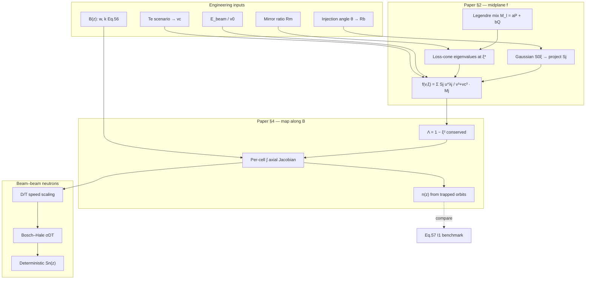
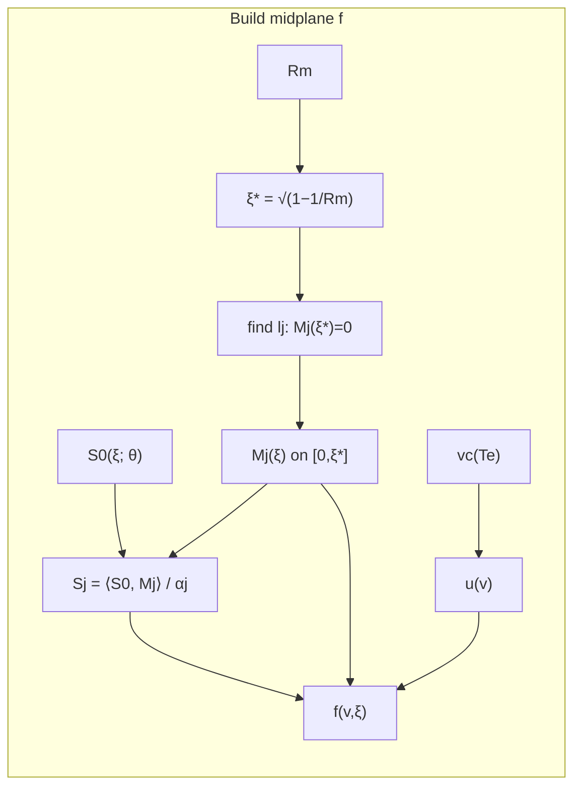
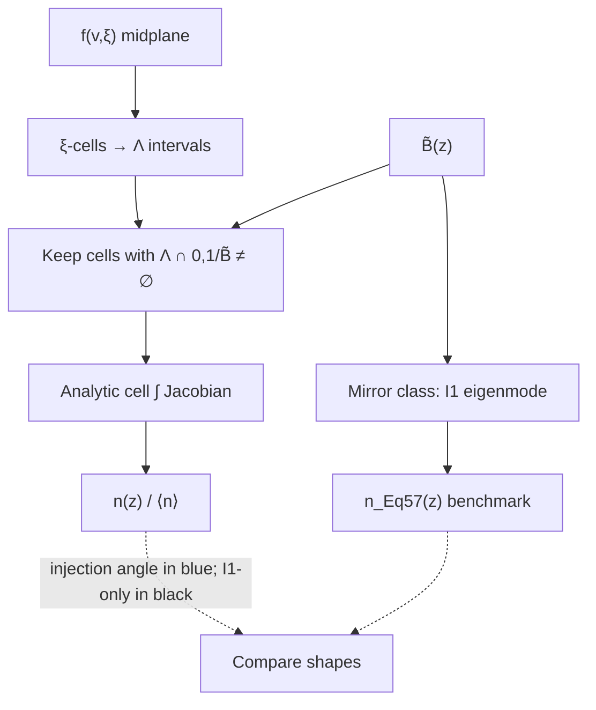
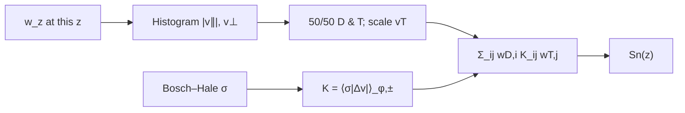
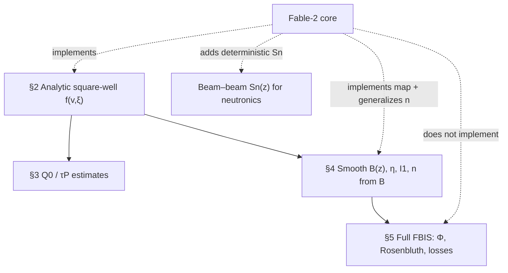

# FBIS Fable-2 Core: Axial Neutron Source Pipeline

**Audience:** advisor brief / technical walkthrough  
**Code:** [`fbis_core_fable_2.py`](fbis_core_fable_2.py) (+ CLI [`compute_neutron_source_fable_2.py`](compute_neutron_source_fable_2.py))  
**Paper:** Egedal, Endrizzi, Forest, Fowler, *Nucl. Fusion* **62** 126053 (2022) — analytic §§2–4 (not full FBIS §5)

---

## 1. What problem this solves

We need a **spatial neutron source shape** \(S_n(z)\) for a beam-driven magnetic mirror (e.g. for OpenMC / blanket studies), including **NBI injection angle**, without running the full iterative FBIS code.

**Output (normalized shapes only):**
- Midplane distribution \(f(v,\xi)\)
- Axial density \(n(z)/\langle n\rangle\) from mapped \(f\)
- Axial neutron source \(S_n(z)\) (beam–beam DT), \(\int_0^1 S_n\,dz = 1\)
- Benchmark: Eq. (57) density from \(I_1\) alone (no injection angle)

**Not included (yet):** ambipolar \(\Phi(z)\), Rosenbluth energy diffusion, absolute \(n\) [\(\mathrm{m}^{-3}\)] from beam amps, radial \(S_n(r,z)\).

---

## 2. End-to-end pipeline



---

## 3. Stage A — Midplane distribution \(f(v,\xi)\)

### Physics idea
Steady Fokker–Planck at the midplane (drag + pitch-angle scattering + monoenergetic anisotropic source) separates in eigenfunctions of the Lorentz operator \(L\):

\[
f(v,\xi)=\sum_j S_j\,\frac{u(v)^{\lambda_j}}{v^3+v_c^3}\,M_j(\xi)
\quad\text{(paper Eq. 14)}
\]

- \(M_j\): linear combo of non-integer Legendre \(P_l\) and \(Q_l\) with \(M(0)=1\), \(M'(0)=0\), and \(M(\xi^*)=0\)
- \(\xi^*=\sqrt{1-1/R_m}\) — loss-cone edge
- \(\lambda_j=l_j(l_j+1)\) — eigenvalue of \(L\)
- \(S_j\): projection of NBI source \(S_0(\xi)\) onto \(\{M_j\}\) **only on** \([0,\xi^*]\) (paper domain; outside is analytic continuation junk)

### Injection angle
Gaussian source peaked at \(\xi_b=\cos\theta=v_\parallel/v\):

\[
R_b=\frac{1}{\sin^2\theta},\qquad
\xi_b=\sqrt{1-\frac{1}{R_b}}
\]

| \(\theta\) to \(B\) | \(R_b\) | Meaning |
|---------------------|---------|---------|
| \(\approx 77^\circ\) | \(\approx 1.05\) | near-perpendicular |
| \(45^\circ\) | \(2\) | classic “45° NBI” |
| \(30^\circ\) | \(4\) | more parallel / sloshing |

### Electron temperature (scenario, not a coil knob)
\[
E_c\approx 20\,T_e
\quad\Rightarrow\quad
\frac{v_c}{v_0}=\sqrt{\frac{20\,T_e}{E_\mathrm{beam}}}
\]
Default example: \(E_\mathrm{beam}=60\,\mathrm{keV}\), \(v_c/v_0=22/60\) → \(T_e\sim 0.4\,\mathrm{keV}\).

\(\beta_m\approx 0.5\) for pure DT (paper); controls pitch depletion strength in \(u^{\lambda\beta_m/3}\).



**Important (notes / Matlab):** Fig. 3 of the paper needs **multi-mode** \(S_j\), not \(M_1\) alone.

---

## 4. Stage B — Map \(f\) along \(B(z)\) → \(n(z)\)

### Magnetic field (analytic, paper Eq. 56)
\[
\tilde B(z)=B(z)/B_0
\]
controlled by mirror ratio \(R_m\) and throat width \(w\) (square well as \(w\to 0\)).

### Constant of motion
\[
\Lambda=\frac{\mu B_0}{E}=1-\xi^2\quad\text{(midplane)}
\]
An orbit reaches location \(z\) only if \(\Lambda < 1/\tilde B(z)\). Locally:
\[
\frac{v_\perp}{v}=\sqrt{\Lambda\tilde B},\qquad
\frac{|v_\parallel|}{v}=\sqrt{1-\Lambda\tilde B}.
\]

### Density (generalized Eq. 57)
Bounce Jacobian \(\propto \tilde B/\sqrt{1-\tilde B\Lambda}\) is **integrably singular** at the turning point. Fable-2 integrates it **analytically over each midplane \(\xi\)-cell’s \(\Lambda\) interval** (no point-sample spikes):

\[
\int\frac{\tilde B\,d\Lambda}{2\sqrt{1-\tilde B\Lambda}}
=\sqrt{1-\tilde B\Lambda_\mathrm{lo}}-\sqrt{1-\tilde B\Lambda_\mathrm{ub}}
\]

→ smooth \(n(z)\); at midplane \(\tilde B=1\) this reduces to the direct \(\int f\,d^3v\).



**Engineering read of results:**  
Near-perp beams → density flat in the well, drops toward throat.  
Angled beams → **sloshing peak** off midplane where those orbits bounce.

---

## 5. Stage C — Deterministic beam–beam \(S_n(z)\)

At each \(z\), local weights \(w\) on \((|v_\parallel|,v_\perp)\):

1. Bin onto a coarse \((|v_\parallel|,v_\perp)\) grid  
2. Split 50/50 into **D** and **T** with the **same energy** distribution  
3. Scale tritium speeds: \(v_T = v_D\sqrt{m_D/m_T}\approx 0.817\,v_D\)  
4. Sum only **D–T** pairs (not D–D / T–T with the DT cross section)  
5. Average exactly over relative gyrophase and \(\pm v_\parallel\) bounce signs  
6. Bosch–Hale \(\sigma_\mathrm{DT}(E_\mathrm{cm})\) with  
   \(E_\mathrm{cm}=0.6\,E_\mathrm{beam}\,|\Delta\hat v|^2\)

**No Monte Carlo** → reproducible, smooth \(S_n(z)\). Absolute barns cancel after normalizing \(\int S_n dz=1\).



Often \(S_n\) **tracks** \(n^2\) but is **not identical**: near turning points \(v_\parallel\to 0\) and the spectrum changes, so effective \(\langle\sigma v\rangle\) drops and the neutron peak can be weaker than the density peak.

---

## 6. What you vary vs what you get

### Good engineering / design parameters
| Knob | Code | Effect |
|------|------|--------|
| Mirror ratio | `Rm` | Loss cone, confinement, \(\xi^*\) |
| Field shape | `w`, `k` | How square the well is; sloshing location |
| Beam energy | `E_beam`, `v0` | Fusion-relevant spectrum |
| Injection angle | `R_b` or \(\theta\) | Midplane vs sloshing \(n\) and \(S_n\) |
| \(T_e\) *scenario* | `vc` | Drag / critical energy (from 0D power balance) |

### Not primary knobs in this tool
| Quantity | Role |
|----------|------|
| \(T_i\) | **Output** of \(f(v)\), not an input |
| Absolute density / neutron rate | Needs \(I_\mathrm{beam}\), volume — deferred |
| \(\beta_m\) | Physics constant (~0.5 for pure DT) |

---

## 7. How this sits relative to the paper



| Paper piece | In Fable-2? |
|-------------|-------------|
| Legendre \(M_l\), multi-mode \(S_j\), Eq. 14 | Yes |
| Analytic \(B(z)\) Eq. 56 | Yes |
| Eq. 57 \(I_1\) density benchmark | Yes (`Mirror`) |
| Mapped \(n(z)\) from full NBI \(f\) | Yes (extension) |
| Deterministic DT \(S_n(z)\) | Yes (for neutronics) |
| Ambipolar \(\Phi\), energy diffusion, loss-cone kinetics | **No** (§5) |

---

## 8. Example figures to show

1. **Injection-angle scan** — \(n(z)\) and \(S_n(z)\) for \(\theta=77^\circ,45^\circ,30^\circ\)  
   → near-perp flat; angled beams develop off-midplane (sloshing) peaks  
2. **Single-case 4-panel** — \(B(z)\), \(n\) vs Eq. 57, \(S_n\) vs \([n]^2\), midplane \(f(v,\xi)\)  
3. **Message for neutronics:** use **mapped \(S_n(z)\)** (red), not Eq. 57 or raw \([n]^2\), when injection is off-perpendicular

---

## 9. One-slide summary

> We take the Egedal et al. (2022) semi-analytic FBIS framework through §§2–4: build a multi-mode midplane beam distribution including NBI pitch, map it along a model \(B(z)\) with a singularity-safe bounce Jacobian, and form a **reproducible DT beam–beam neutron source profile** \(S_n(z)\). Injection angle is a first-class engineering input; \(T_e\) enters only as a critical-velocity scenario; absolute normalization and full §5 physics are left for later. The result is a neutronics-ready **axial source shape** that captures sloshing when beams are not perpendicular.

---

## 10. How to run

```bash
cd FBIS-py
# Point CLI at fable_2 (or: import fbis_core_fable_2 as fbis_core)
python compute_neutron_source_fable_2.py --Rm 16 --w 0.1 --R-b 2 --no-show
python plot_angle_scan.py   # if wired to fable_2
```

Primary module to cite in slides: **`fbis_core_fable_2.py`**.
